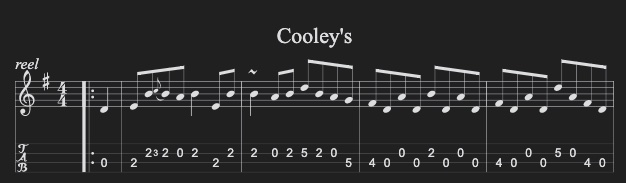

# Obsidian ABC.JS plugin

Obsidian plugin which renders ABC music notation from code blocks using the `abc` language specifier.

Under the hood it uses [abcjs](https://paulrosen.github.io/abcjs/) library and supports all the features that abcjs provides.

## Examples

### Simple song


    ```music-abc
    X:1
    T:The Legacy Jig
    M:6/8
    L:1/8
    R:jig
    K:G
    GFG BAB | gfg gab | GFG BAB | d2A AFD |
    GFG BAB | gfg gab | age edB |1 dBA AFD :|2 dBA ABd |:
    efe edB | dBA ABd | efe edB | gdB ABd |
    efe edB | d2d def | gfe edB |1 dBA ABd :|2 dBA AFD |]
    ```

### Chorus music

    ```music-abc
    X: 1
    T: Chorus
    V: T1 clef=treble name="Soprano"
    V: T2 clef=treble name="Alto"
    V: B1 clef=bass name="Tenor"
    V: B2 clef=bass name="Bass"
    L:1/8
    K:G
    P:First Part
    [V: T1]"C"ed"Am"ed "F"cd"G7"gf |
    [V: T2]GGAA- A2BB |
    [V: B1]C3D- DF,3 |
    [V: B2]C,2A,,2 F,,2G,,2 |
    ```

### Custom options

You can pass custom options to the `renderAbc` function by adding a JSON string at the top of the code block followed by `---`. Note that there may not be any whitespaces before or after the JSON.



    ```music-abc
    {
      "tablature": [{"instrument": "violin"}]
    }
    ---
    X:1
    T: Cooley's
    M: 4/4
    L: 1/8
    R: reel
    K: G
    |:D2|EB{c}BA B2 EB|~B2 AB dBAG|FDAD BDAD|FDAD dAFD|
    ```
### Add Swing to your 4/4 Tunes

```music-abc
{"swing": 70}
---
X:1
T:It Don't Mean A Thing
M:4/4 
L:1/8 
K:_B
V:Guitar clef=treble 
V:Bass clef=bass 
V:Drums clef=perc
[V:Guitar] 
%%MIDI program 24
G2 z2 G2 _B2|d2 z2 z2 z2| _d_d z2 c2 _b,2| G4 z4 |G2 z2 G2 _B2|d2 z2 z2 z2| _d_d _d_d c2 _b,2| G4 z4 | G,_B, d,g, _g,_b, dg|f_b d'g' e'2 z2 z_d|c_d c_d c_B | E2 z4|
[V:Bass] 
%%MIDI program 32
G,,4 _G,,4|F,,4 E,,4|_E,,4 D,,4|G,,4 z4 |G,,4 _G,,2 zE,,|F,,4 E,,4|_E,,4 D,,4|G,,4 z4 |G,,4 _G,,4|F,,4 E,,4|_E,,4 D,,4|:G,,2 _G,,2 F,,2 E,,F,, |_G,,2 F,,2 E,,2 D,,2|_E,,2 _E,2 ^F,,2 A,,,^F,,|G,,4 z4:|
[V:Drums] 
%%MIDI channel 10
B,,2 B,,B,, B,,2 B,,B,,|B,,2 B,,B,, B,,2 B,,B,,|B,,2 B,,B,, B,,2 B,,B,,|B,,2 B,,B,, B,,2 B,,B,,|B,,2 B,,B,, B,,2 B,,B,,|B,,2 B,,B,, B,,2 B,,B,,|B,,2 B,,B,, B,,2 B,,B,,|^D,^D,^D,^D,^D,^D,^D,^D,:| ^D,2  ^D,^D,  ^D,2  ^D,^D,| ^D,4
```
   
When the JSON is invalid, the plugin will still try to render the music block but shows a big red banner at the top with the error so you can't miss it.

For a full reference of all options you can use, have a look at the [official abcjs documentation](https://paulrosen.github.io/abcjs/visual/render-abc-options.html).

## Maintenance & Contributions

The plugin is maintained by the [abcjs-music](https://github.com/abcjs-music) organization of volunteers, including Til Blechschmidt, the original author.
If you have any feedback, please feel free to open an issue. If you know your way around source code, please consider making a pull request. All contributions are welcome.

# Development

- clone the repository
- `npm i` to install all the dependencies
- `npm run build` to compile
- copy main.js, manifest.json, and styles.css into your plugin directory (`.obsidian/plugins/<plugin-name>`)

# License

Copyright (C) 2025  ABCJS Organization <https://github.com/abcjs-music>